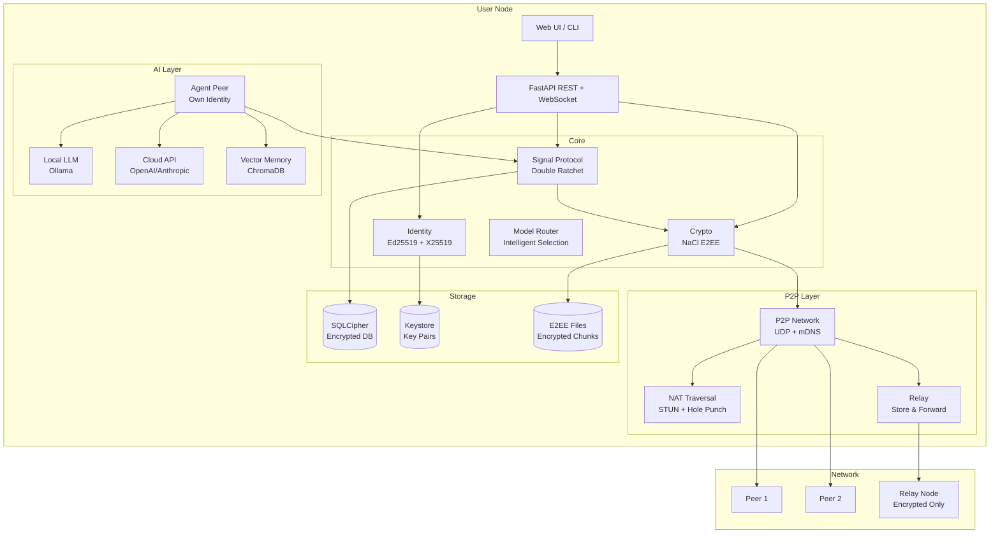

<p align="center">
  
</p>

<p align="center">
  <strong>Self-hosted Multi-Agent AI Platform</strong><br>
  <a href="https://github.com/zyay/hive/actions/workflows/ci.yml"></a>
</p>

> **v1.0.0** — 10 LLM providers · RAG pipeline · Agent templates · 5 new tools · Dark/light UI · Multi-stage Docker · Backup/restore · CI/CD · 92+ tests

Create, manage, and chat with AI agents powered by any LLM provider — all running on your own machine. Agents can delegate to each other, compare models side-by-side, remember across sessions, run on schedule, and query your documents with retrieval-augmented generation.

## What is Hive?

Hive is a self-hosted platform for orchestrating AI agents. Each agent has its own personality (system prompt), model, and tools. You can create agents, chat with them, and monitor costs — all from a professional web dashboard.

Instead of being locked into one AI provider, Hive lets you switch between 10+ providers with a single config change. Use Ollama for free local inference, OpenAI for quality, Groq for speed, or OpenRouter for access to 300+ models.

## Features

### Core
| Feature | Description |
|---|---|
| **Multi-provider LLM layer** | 10 providers via 2 adapters (OpenAI-compat + Anthropic native) |
| **Agent management** | Create, edit, delete agents with custom prompts, models, and tools |
| **Agent templates** | 8 pre-configured archetypes — one-click agent creation |
| **Tool calling** | Built-in tools + extensible `@register_tool` decorator |
| **Cost tracking** | Per-request cost estimation, token counting, latency monitoring |
| **Conversation memory** | Persistent conversations with async SQLite (aiosqlite) |
| **Web UI** | Dark/light theme, mobile responsive, markdown + code highlighting, export |
| **Docker Compose** | One command: `docker compose up` — multi-stage, non-root, health checks |

### Advanced
| Feature | Description |
|---|---|
| **RAG pipeline** | Document upload, chunking, embedding (sentence-transformers), semantic retrieval |
| **Swarm orchestration** | Agent-to-agent delegation via `call_agent` tool |
| **Model Arena** | Compare N models on same prompt — latency, cost, response side-by-side |
| **Model Router** | Intelligent model selection based on task analysis (coding, reasoning, budget, speed) |
| **Adaptive reasoning** | Auto-detect task complexity and recommend effort level |
| **Vector memory** | ChromaDB + sentence-transformers semantic recall per agent |
| **SSE streaming** | Real-time token streaming via `/api/chat/stream` |
| **JWT authentication** | Zero-dependency HMAC-SHA256 token create/verify |
| **Full cron parser** | 5-field cron with ranges, steps, commas — no external deps |
| **Prometheus metrics** | Counters, histograms, gauges + text export at `/api/metrics/prometheus` |
| **Cost optimizer** | Usage analysis + savings recommendations |
| **MCP integrations** | Connect to mcp-agent-tools and mcp-rag-bridge as plugins |
| **Benchmark suite** | 18 prompts across 4 categories (reasoning, coding, factual, creative) |
| **Voice I/O** | Whisper STT + OpenAI TTS integration |
| **Scheduled automations** | Cron-based agent tasks with background scheduler loop |
| **Backup / restore** | One-command backup and restore of all data (DB, keys, uploads, memory) |
| **CI/CD** | GitHub Actions — lint, test, build, Docker with coverage + Codecov |

## RAG Pipeline

Upload documents and query them with retrieval-augmented generation. Hive handles the full lifecycle:

1. **Ingest** — upload PDF, TXT, MD, CSV, or code files via the API
2. **Chunk** — split into overlapping chunks (500 tokens, 50 overlap)
3. **Embed** — vectorize with `all-MiniLM-L6-v2` (sentence-transformers)
4. **Store** — persist in ChromaDB for semantic search
5. **Retrieve** — query returns relevant chunks, injected into agent context

```bash
# Ingest a document
curl -X POST http://localhost:8000/api/rag/ingest \
  -H "Content-Type: application/json" \
  -d '{"filename": "report.pdf", "content_base64": "..."}'

# Query your documents
curl -X POST http://localhost:8000/api/rag/query \
  -H "Content-Type: application/json" \
  -d '{"query": "What is the revenue growth?", "top_k": 5}'
```

Supported formats: PDF, TXT, MD, CSV, and 20+ code file extensions (.py, .js, .ts, .go, .rs, .java, .c, .cpp, .h, .rb, .php, .swift, .kt, and more).

## Agent Templates

8 pre-configured archetypes to get started instantly — each with tuned system prompts, default models, and tool access:

| Template | Description | Tools |
|---|---|---|
| **Code Assistant** | Debug, refactor, write code | calculator, execute_code, web_search |
| **Research Agent** | Deep research with web access | web_search, fetch_url |
| **Writing Assistant** | Draft, edit, improve text | — (temperature 0.8) |
| **Data Analyst** | Analyze data, run calculations | calculator, execute_code |
| **DevOps Agent** | Infrastructure and automation | calculator, execute_code, web_search |
| **Tutor** | Teach and explain concepts | calculator, web_search |
| **Knowledge Assistant** | RAG-grounded document Q&A | RAG context builder |
| **Creative Agent** | Brainstorm, generate images | generate_image (temperature 1.2) |

```bash
# List all templates
curl http://localhost:8000/api/templates

# Create an agent from a template
curl -X POST http://localhost:8000/api/templates/create \
  -H "Content-Type: application/json" \
  -d '{"template_id": "coding_assistant", "name": "My Coder"}'
```

## Tools

Beyond the built-in calculator and `call_agent`, Hive includes 5 additional tools:

| Tool | Description |
|---|---|
| **web_search** | Search the web via DuckDuckGo — no API key required |
| **fetch_url** | Fetch and extract content from any URL |
| **execute_code** | Run Python code in a sandboxed subprocess (30s timeout) |
| **generate_image** | Generate images via DALL-E 3 (requires OpenAI API key) |
| **world_clock** | Display current time across multiple timezones |

All tools are registered via the `@register_tool` decorator and can be assigned to agents individually.

## Architecture

```
Web UI (dark/light, mobile responsive)
    |
    v
FastAPI Backend (async, aiosqlite)
    |
    +-- Agent Loop (tool calling, multi-turn)
    +-- Model Layer (10 providers, 2 adapters)
    +-- Swarm (agent-to-agent delegation)
    +-- Model Router (intelligent selection)
    +-- Adaptive Reasoning (complexity detection)
    +-- Agent Templates (8 archetypes)
    |
    +-- RAG Pipeline
    |   +-- Document Ingestion (PDF, TXT, MD, CSV, code)
    |   +-- Chunking (500 tokens, 50 overlap)
    |   +-- Embedding (all-MiniLM-L6-v2)
    |   +-- Retrieval (ChromaDB semantic search)
    |
    +-- Memory
    |   +-- SQLite (async, keyword-based, WAL mode)
    |   +-- ChromaDB (vector embeddings)
    |
    +-- Streaming (SSE real-time)
    +-- Auth (JWT, API keys)
    +-- Metrics (Prometheus)
    +-- Cron (full 5-field parser)
    +-- Cost Optimizer
    +-- Backup / Restore
    |
    +-- MCP Integrations
    |   +-- mcp-agent-tools (19 tools)
    |   +-- mcp-rag-bridge (7 tools)
    |
    +-- Benchmark Suite (18 prompts, 4 categories)
    +-- Voice I/O (Whisper + TTS)
    |
    v
SQLite (async) + ChromaDB (persistent storage)
```

## Quick start

```bash
git clone https://github.com/zyay/hive.git
cd hive
python -m venv venv && venv\Scripts\activate    # Windows
pip install -r requirements.txt
cp .env.example .env                             # edit with your API keys
python main.py
# Open http://127.0.0.1:8000
```

### Docker

```bash
docker compose up --build
```

The Docker image uses a multi-stage build (smaller final image), runs as a non-root `hive` user, and includes a health check at `/health` every 30 seconds.

### Backup & restore

```bash
python backup.py backup          # create timestamped archive
python backup.py list            # list available backups
python backup.py restore backups/hive_20250816_120000.tar.gz
```

Backs up: databases, keystore, uploads, memory, skills, scheduler state.

### Tailscale (share with team)

Hive listens on `0.0.0.0` by default — accessible over Tailscale.

**Quick setup (Linux/macOS):**
```bash
chmod +x setup.sh
./setup.sh
```

**Quick setup (Windows):**
```
setup.bat
```

**Manual setup:**
```bash
# 1. Install Tailscale
curl -fsSL https://tailscale.com/install.sh | sh   # Linux
# or: winget install Tailscale.Tailscale            # Windows
# or: brew install tailscale                        # macOS

# 2. Connect
tailscale up

# 3. Get your Tailscale IP
tailscale ip -4
# → 100.64.x.x

# 4. Start Hive
python main.py

# 5. Share with team
# Anyone on your Tailnet opens: http://100.64.x.x:8000
```

**Docker + Tailscale:**
```bash
# Get auth key from https://login.tailscale.com/settings/keys
export TS_AUTHKEY=tskey-...
docker compose -f docker-compose.tailscale.yml up
```

**How it works:**
- Each user registers their own account (username + password)
- Each user adds their own API keys (OpenAI, Anthropic, etc.)
- Create group rooms → invite users → chat in real-time
- Invite AI bots to rooms → agents see all messages and respond
- Share files via the File button in chat

## Supported providers

| Provider | Type | Default model | Context | Cost (in/out per 1M) |
|---|---|---|---|---|
| Ollama | Local | llama3.3 | 128K | $0 |
| LM Studio | Local | any | varies | $0 |
| OpenAI | Cloud | gpt-4.1-mini | 1M | $0.40 / $1.60 |
| Anthropic | Cloud | claude-sonnet-4 | 200K | $3.00 / $15.00 |
| Google Gemini | Cloud | gemini-2.5-flash | 1M | free tier |
| Groq | Fast | llama-3.3-70b | 128K | $0.59 / $0.79 |
| Mistral | Cloud | mistral-large | 128K | $2.00 / $6.00 |
| OpenRouter | 300+ models | claude-3.5-sonnet | varies | varies |
| xAI | Cloud | grok-3-mini | 131K | $0.30 / $0.50 |
| DeepSeek | Cloud | deepseek-chat | 128K | $0.27 / $1.10 |

## API reference

### Core
| Endpoint | Method | Description |
|---|---|---|
| `/` | GET | Web UI |
| `/health` | GET | Health check |
| `/api/providers` | GET | List configured providers |
| `/api/models` | GET | All models with intelligence rankings |
| `/api/agents` | GET/POST | List / create agents |
| `/api/agents/{id}` | GET/PUT/DELETE | Agent CRUD |
| `/api/chat` | POST | Chat with agent |
| `/api/chat/stream` | POST | SSE streaming chat |
| `/api/usage` | GET | Usage statistics |

### RAG
| Endpoint | Method | Description |
|---|---|---|
| `/api/rag/ingest` | POST | Upload and ingest a document |
| `/api/rag/ingest/text` | POST | Ingest raw text |
| `/api/rag/query` | POST | Semantic search over documents |
| `/api/rag/documents` | GET | List ingested documents |
| `/api/rag/documents/{id}` | DELETE | Delete a document |
| `/api/rag/context` | POST | Build retrieval context for LLM |

### Templates
| Endpoint | Method | Description |
|---|---|---|
| `/api/templates` | GET | List all agent templates |
| `/api/templates/{id}` | GET | Get a specific template |
| `/api/templates/create` | POST | Create agent from template |

### Intelligence
| Endpoint | Method | Description |
|---|---|---|
| `/api/router` | POST | Intelligent model selection |
| `/api/analyze` | POST | Analyze task complexity |
| `/api/compare` | POST | Compare models side-by-side |
| `/api/arena` | POST | Run arena benchmark |
| `/api/benchmark/run` | POST | Full benchmark suite |
| `/api/benchmark/categories` | GET | List benchmark categories |

### Memory
| Endpoint | Method | Description |
|---|---|---|
| `/api/memory` | GET/POST/DELETE | Keyword memory |
| `/api/memory/vector` | POST | Store vector memory |
| `/api/memory/vector/{id}` | GET | Semantic recall |
| `/api/memory/vector/{id}/all` | GET | List all memories |

### Operations
| Endpoint | Method | Description |
|---|---|---|
| `/api/auth/token` | POST | Create JWT token |
| `/api/auth/verify` | GET | Verify JWT token |
| `/api/keys` | GET/POST | API key management |
| `/api/costs` | GET | Cost optimization analysis |
| `/api/metrics` | GET | Metrics summary (JSON) |
| `/api/metrics/prometheus` | GET | Prometheus text format |
| `/api/cron/next` | POST | Next run time for cron |
| `/api/integrations` | GET | List MCP integrations |
| `/api/integrations/discover` | POST | Discover MCP tools |
| `/api/integrations/call` | POST | Call MCP tool |

## Testing

```bash
pytest tests/ -v          # 92+ tests
pytest --cov=hive         # with coverage
```

CI runs automatically on every push and PR: lint (ruff), test (pytest + coverage on Python 3.11/3.12), build, and Docker image.

## Tech stack

| Component | Technology |
|---|---|
| **Backend** | Python 3.12, FastAPI, aiosqlite |
| **Frontend** | Vanilla HTML/CSS/JS, marked.js, highlight.js |
| **Database** | SQLite (WAL mode, async via aiosqlite) with migration system |
| **Vector store** | ChromaDB + sentence-transformers (all-MiniLM-L6-v2) |
| **Docker** | Multi-stage build, non-root user, health checks |
| **CI/CD** | GitHub Actions (lint → test → build → docker) |
| **Auth** | JWT (zero-dep HMAC-SHA256) |
| **Metrics** | Prometheus-compatible endpoint |

## Design decisions

| Decision | Why |
|---|---|
| **Adapter pattern** | 2 adapters (OpenAI-compat + Anthropic) cover 10 providers |
| **aiosqlite** | Non-blocking DB access — no event loop stalls under load |
| **Migration system** | Versioned schema migrations — safe upgrades without data loss |
| **ChromaDB for vectors** | Persistent, embedded, no separate server |
| **Zero-dep JWT** | No jose/pyjwt needed — pure HMAC-SHA256 |
| **Zero-dep cron** | No croniter needed — full 5-field parser built-in |
| **AST calculator** | No `eval()` — security-first math evaluation |
| **Prometheus format** | Industry standard — works with Grafana out of the box |
| **Multi-stage Docker** | Smaller image, non-root for security, health checks for orchestration |
| **MCP integrations** | Reuse existing tools from sibling projects |

## Related projects

- [rag-docs-assistant](https://github.com/zyay/rag-docs-assistant) — RAG pipeline with hybrid search, reranking, evals, 27 tests
- [mcp-agent-tools](https://github.com/zyay/mcp-agent-tools) — MCP server with 19 tools, sandbox, rate limiting, 30 tests
- [mcp-rag-bridge](https://github.com/zyay/mcp-rag-bridge) — MCP bridge for RAG knowledge bases, 7 tools, 13 tests

## UI v1.1 — Professional Redesign

### What's New

**Professional Apple-Style Interface**
- Monochrome design with single accent blue (#0A84FF)
- No emojis, no decorative gradients
- Clean, minimal, professional aesthetic
- Improved readability with larger fonts and better contrast

**Window Management System**
- Draggable, resizable windows with focus management
- Minimize, maximize, close controls
- Taskbar showing all open windows
- Centered positioning for better UX

**Real Data, No Mocks**
- All agent statistics from real backend (messages, avg response, success rate)
- Real task progress tracking based on elapsed time
- Real agent status (active/idle/offline) from usage_logs
- Dashboard shows actual activity heatmap and metrics

**Fully Functional UI**
- Every button works end-to-end (create, edit, delete)
- Confirmation dialogs for destructive actions
- Loading states and error handling throughout
- Auto-refresh every 10 seconds for active views

**Modular Architecture**
- Separated CSS (`ui.css`) and JS modules
- `ui-agents.js`, `ui-tasks.js`, `ui-files.js`, `ui-dashboard.js`, `ui-settings.js`
- `ui-windows.js` for window management system
- `ui-utils.js` for shared utilities
- Easier to maintain and extend

**Enhanced Features**
- @mention system with real-time agent status
- Command palette (⌘K) for quick navigation
- Drag-and-drop file uploads
- Debounced search (150ms) for better performance
- Keyboard shortcuts (⌘1-6 for views, Escape to close)

### Technical Improvements

**Backend Endpoints**
- `GET /api/agents/stats` — Real statistics from usage_logs and messages tables
- `GET /api/tasks/stats` — Task statistics (pending, running, completed, failed)
- `POST /api/tasks/{id}/cancel` — Cancel running tasks
- All CRUD operations fully functional with error handling

**Database Schema**
- `usage_logs` — Tracks agent calls, tokens, latency, success/failure
- `messages` — Persistent chat history
- `tasks` — Task queue and history with status tracking
- `files` — File metadata and storage

**Performance**
- Auto-refresh only active views (saves API calls)
- Debounced search prevents excessive filtering
- Efficient DOM updates with minimal re-renders
- WebSocket for real-time chat (no polling)

### User Preferences Implemented

✅ No mock data — everything from real backend  
✅ Every UI button functional — not just visual  
✅ Windows more readable — better fonts, contrast, spacing  
✅ Professional design — Apple-style, monochrome, single accent  
✅ Full system functionality — create, edit, delete all work  
✅ Real agent collaboration — works when API keys configured  

## License

MIT

---

## Architecture



## Security Model

### Defense in Depth — 5 Layers

| Layer | Technology | Protection |
|---|---|---|
| **Network** | UDP + Noise Protocol | Transport encryption, NAT traversal |
| **Transport** | TLS 1.3 (relay) | Relay cannot read content |
| **Application** | Signal Protocol (Double Ratchet) | E2EE, Forward Secrecy, Post-Compromise Security |
| **Storage** | SQLCipher (AES-256) | Encrypted database at rest |
| **Identity** | Ed25519 + X25519 | Cryptographic identity, message signing |

### Threat Model

| Threat | Mitigation |
|---|---|
| **Eavesdropping** | All messages E2EE with per-message keys (Double Ratchet) |
| **Message tampering** | Ed25519 signatures on every message |
| **Identity spoofing** | Safety Number verification (OOB fingerprint check) |
| **Database theft** | SQLCipher encryption, keystore protected by password |
| **Relay compromise** | Relay sees only ciphertext, cannot decrypt |
| **Key theft (today)** | Forward Secrecy — past messages remain secure |
| **Key theft + recovery** | Post-Compromise Security — new messages secure after ratchet |
| **MITM attack** | Safety Number comparison via QR code or voice |

### What Hive Does NOT Have (By Design)

- ❌ No central server that can read your messages
- ❌ No phone number or email required
- ❌ No data sent to Hive developers
- ❌ No messages stored on any server you don't control
- ❌ No way for admins to read your chats

### Key Properties

- **Forward Secrecy**: If your key is compromised today, yesterday's messages are safe
- **Post-Compromise Security**: After a key compromise, the next ratchet step creates new secure keys
- **Deniability**: Messages are signed but the protocol allows plausible deniability
- **Minimal Metadata**: Relay nodes see only encrypted blobs, not content or sender identity
