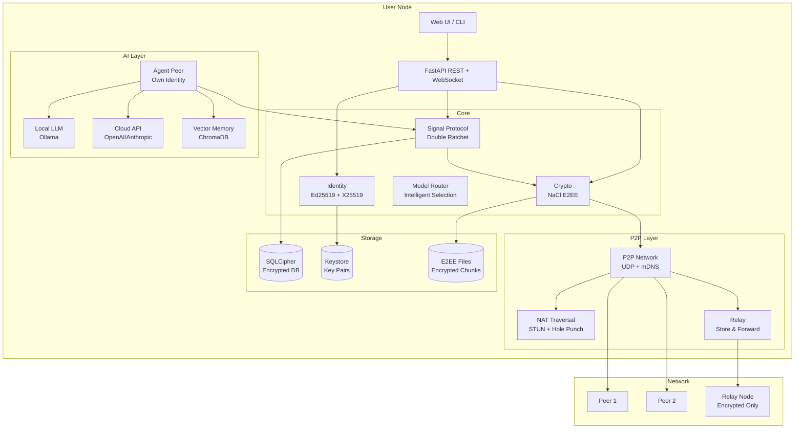

# Hive — Self-hosted Multi-Agent AI Platform

[](https://github.com/zyay/hive/actions/workflows/ci.yml)

> **v0.3** — 10 LLM providers · Swarm orchestration · Vector memory · SSE streaming · JWT auth · Benchmark suite · MCP integrations · 92 tests

Create, manage, and chat with AI agents powered by any LLM provider — all running on your own machine. Agents can delegate to each other, compare models side-by-side, remember across sessions, and run on schedule.

## What is Hive?

Hive is a self-hosted platform for orchestrating AI agents. Each agent has its own personality (system prompt), model, and tools. You can create agents, chat with them, and monitor costs — all from a professional web dashboard.

Instead of being locked into one AI provider, Hive lets you switch between 10+ providers with a single config change. Use Ollama for free local inference, OpenAI for quality, Groq for speed, or OpenRouter for access to 300+ models.

## Features

### Core
| Feature | Description |
|---|---|
| **Multi-provider LLM layer** | 10 providers via 2 adapters (OpenAI-compat + Anthropic native) |
| **Agent management** | Create, edit, delete agents with custom prompts, models, and tools |
| **Tool calling** | Built-in tools + extensible `@register_tool` decorator |
| **Cost tracking** | Per-request cost estimation, token counting, latency monitoring |
| **Conversation memory** | Persistent conversations in SQLite |
| **Web UI** | Professional dark dashboard — 7 tabs (Chat, Models, Router, Arena, Costs, API Keys, Settings) |
| **Docker Compose** | One command: `docker compose up` |

### Advanced
| Feature | Description |
|---|---|
| **Swarm orchestration** | Agent-to-agent delegation via `call_agent` tool |
| **Model Arena** | Compare N models on same prompt — latency, cost, response side-by-side |
| **Model Router** | Intelligent model selection based on task analysis (coding, reasoning, budget, speed) |
| **Adaptive reasoning** | Auto-detect task complexity and recommend effort level |
| **Vector memory** | ChromaDB + sentence-transformers semantic recall per agent |
| **SSE streaming** | Real-time token streaming via `/api/chat/stream` |
| **JWT authentication** | Zero-dependency HMAC-SHA256 token create/verify |
| **Full cron parser** | 5-field cron with ranges, steps, commas — no external deps |
| **Prometheus metrics** | Counters, histograms, gauges + text export at `/api/metrics/prometheus` |
| **Cost optimizer** | Usage analysis + savings recommendations |
| **MCP integrations** | Connect to mcp-agent-tools and mcp-rag-bridge as plugins |
| **Benchmark suite** | 18 prompts across 4 categories (reasoning, coding, factual, creative) |
| **Voice I/O** | Whisper STT + OpenAI TTS integration |
| **Scheduled automations** | Cron-based agent tasks with background scheduler loop |

## Architecture

```
Web UI (7 tabs)
    |
    v
FastAPI Backend
    |
    +-- Agent Loop (tool calling, multi-turn)
    +-- Model Layer (10 providers, 2 adapters)
    +-- Swarm (agent-to-agent delegation)
    +-- Model Router (intelligent selection)
    +-- Adaptive Reasoning (complexity detection)
    |
    +-- Memory
    |   +-- SQLite (keyword-based)
    |   +-- ChromaDB (vector embeddings)
    |
    +-- Streaming (SSE real-time)
    +-- Auth (JWT, API keys)
    +-- Metrics (Prometheus)
    +-- Cron (full 5-field parser)
    +-- Cost Optimizer
    |
    +-- MCP Integrations
    |   +-- mcp-agent-tools (19 tools)
    |   +-- mcp-rag-bridge (7 tools)
    |
    +-- Benchmark Suite (18 prompts, 4 categories)
    +-- Voice I/O (Whisper + TTS)
    |
    v
SQLite + ChromaDB (persistent storage)
```

## Quick start

```bash
git clone https://github.com/zyay/hive.git
cd hive
python -m venv venv && venv\Scripts\activate    # Windows
pip install -r requirements.txt
cp .env.example .env                             # edit with your API keys
python main.py
# Open http://127.0.0.1:8000
```

### Docker

```bash
docker compose up --build
```

### Tailscale (share with team)

Hive listens on `0.0.0.0` by default — accessible over Tailscale.

**Quick setup (Linux/macOS):**
```bash
chmod +x setup.sh
./setup.sh
```

**Quick setup (Windows):**
```
setup.bat
```

**Manual setup:**
```bash
# 1. Install Tailscale
curl -fsSL https://tailscale.com/install.sh | sh   # Linux
# or: winget install Tailscale.Tailscale            # Windows
# or: brew install tailscale                        # macOS

# 2. Connect
tailscale up

# 3. Get your Tailscale IP
tailscale ip -4
# → 100.64.x.x

# 4. Start Hive
python main.py

# 5. Share with team
# Anyone on your Tailnet opens: http://100.64.x.x:8000
```

**Docker + Tailscale:**
```bash
# Get auth key from https://login.tailscale.com/settings/keys
export TS_AUTHKEY=tskey-...
docker compose -f docker-compose.tailscale.yml up
```

**How it works:**
- Each user registers their own account (username + password)
- Each user adds their own API keys (OpenAI, Anthropic, etc.)
- Create group rooms → invite users → chat in real-time
- Invite AI bots to rooms → agents see all messages and respond
- Share files via the File button in chat

## Supported providers

| Provider | Type | Default model | Context | Cost (in/out per 1M) |
|---|---|---|---|---|
| Ollama | Local | llama3.3 | 128K | $0 |
| LM Studio | Local | any | varies | $0 |
| OpenAI | Cloud | gpt-4.1-mini | 1M | $0.40 / $1.60 |
| Anthropic | Cloud | claude-sonnet-4 | 200K | $3.00 / $15.00 |
| Google Gemini | Cloud | gemini-2.5-flash | 1M | free tier |
| Groq | Fast | llama-3.3-70b | 128K | $0.59 / $0.79 |
| Mistral | Cloud | mistral-large | 128K | $2.00 / $6.00 |
| OpenRouter | 300+ models | claude-3.5-sonnet | varies | varies |
| xAI | Cloud | grok-3-mini | 131K | $0.30 / $0.50 |
| DeepSeek | Cloud | deepseek-chat | 128K | $0.27 / $1.10 |

## API reference

### Core
| Endpoint | Method | Description |
|---|---|---|
| `/` | GET | Web UI |
| `/health` | GET | Health check |
| `/api/providers` | GET | List configured providers |
| `/api/models` | GET | All models with intelligence rankings |
| `/api/agents` | GET/POST | List / create agents |
| `/api/agents/{id}` | GET/PUT/DELETE | Agent CRUD |
| `/api/chat` | POST | Chat with agent |
| `/api/chat/stream` | POST | SSE streaming chat |
| `/api/usage` | GET | Usage statistics |

### Intelligence
| Endpoint | Method | Description |
|---|---|---|
| `/api/router` | POST | Intelligent model selection |
| `/api/analyze` | POST | Analyze task complexity |
| `/api/compare` | POST | Compare models side-by-side |
| `/api/arena` | POST | Run arena benchmark |
| `/api/benchmark/run` | POST | Full benchmark suite |
| `/api/benchmark/categories` | GET | List benchmark categories |

### Memory
| Endpoint | Method | Description |
|---|---|---|
| `/api/memory` | GET/POST/DELETE | Keyword memory |
| `/api/memory/vector` | POST | Store vector memory |
| `/api/memory/vector/{id}` | GET | Semantic recall |
| `/api/memory/vector/{id}/all` | GET | List all memories |

### Operations
| Endpoint | Method | Description |
|---|---|---|
| `/api/auth/token` | POST | Create JWT token |
| `/api/auth/verify` | GET | Verify JWT token |
| `/api/keys` | GET/POST | API key management |
| `/api/costs` | GET | Cost optimization analysis |
| `/api/metrics` | GET | Metrics summary (JSON) |
| `/api/metrics/prometheus` | GET | Prometheus text format |
| `/api/cron/next` | POST | Next run time for cron |
| `/api/integrations` | GET | List MCP integrations |
| `/api/integrations/discover` | POST | Discover MCP tools |
| `/api/integrations/call` | POST | Call MCP tool |

## Testing

```bash
pytest tests/ -v          # 92 tests
pytest --cov=hive         # with coverage
```

## Design decisions

| Decision | Why |
|---|---|
| **Adapter pattern** | 2 adapters (OpenAI-compat + Anthropic) cover 10 providers |
| **SQLite** | Zero-config, single-file, perfect for self-hosted |
| **ChromaDB for vectors** | Persistent, embedded, no separate server |
| **Zero-dep JWT** | No jose/pyjwt needed — pure HMAC-SHA256 |
| **Zero-dep cron** | No croniter needed — full 5-field parser built-in |
| **AST calculator** | No `eval()` — security-first math evaluation |
| **Prometheus format** | Industry standard — works with Grafana out of the box |
| **MCP integrations** | Reuse existing tools from sibling projects |

## Related projects

- [rag-docs-assistant](https://github.com/zyay/rag-docs-assistant) — RAG pipeline with hybrid search, reranking, evals, 27 tests
- [mcp-agent-tools](https://github.com/zyay/mcp-agent-tools) — MCP server with 19 tools, sandbox, rate limiting, 30 tests
- [mcp-rag-bridge](https://github.com/zyay/mcp-rag-bridge) — MCP bridge for RAG knowledge bases, 7 tools, 13 tests

## License

MIT

---

## Architecture



## Security Model

### Defense in Depth — 5 Layers

| Layer | Technology | Protection |
|---|---|---|
| **Network** | UDP + Noise Protocol | Transport encryption, NAT traversal |
| **Transport** | TLS 1.3 (relay) | Relay cannot read content |
| **Application** | Signal Protocol (Double Ratchet) | E2EE, Forward Secrecy, Post-Compromise Security |
| **Storage** | SQLCipher (AES-256) | Encrypted database at rest |
| **Identity** | Ed25519 + X25519 | Cryptographic identity, message signing |

### Threat Model

| Threat | Mitigation |
|---|---|
| **Eavesdropping** | All messages E2EE with per-message keys (Double Ratchet) |
| **Message tampering** | Ed25519 signatures on every message |
| **Identity spoofing** | Safety Number verification (OOB fingerprint check) |
| **Database theft** | SQLCipher encryption, keystore protected by password |
| **Relay compromise** | Relay sees only ciphertext, cannot decrypt |
| **Key theft (today)** | Forward Secrecy — past messages remain secure |
| **Key theft + recovery** | Post-Compromise Security — new messages secure after ratchet |
| **MITM attack** | Safety Number comparison via QR code or voice |

### What Hive Does NOT Have (By Design)

- ❌ No central server that can read your messages
- ❌ No phone number or email required
- ❌ No data sent to Hive developers
- ❌ No messages stored on any server you don't control
- ❌ No way for admins to read your chats

### Key Properties

- **Forward Secrecy**: If your key is compromised today, yesterday's messages are safe
- **Post-Compromise Security**: After a key compromise, the next ratchet step creates new secure keys
- **Deniability**: Messages are signed but the protocol allows plausible deniability
- **Minimal Metadata**: Relay nodes see only encrypted blobs, not content or sender identity
